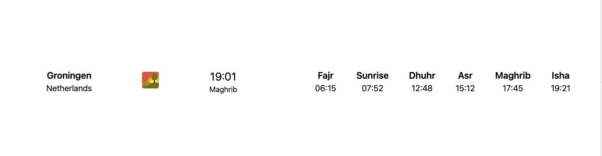

# Notion Namaz Time



Prayer times for Groningen (ISNA), built as a small Next.js widget. Live clock and today’s Fajr, Sunrise, Dhuhr, Asr, Maghrib, Isha.

## What it does

Single-page app: location (Groningen, Netherlands), current time, current prayer period, and all six times for the day. Uses [Aladhan API](https://aladhan.com/prayer-times-api) with **ISNA** calculation method.

## How to run

```bash
npm install
npm run dev
```

Open **http://localhost:3000/notion-namaz-time/** (app uses `basePath: '/notion-namaz-time'` for GitHub Pages).

Static export (e.g. for hosting):

```bash
npm run export
```

Output is in `docs/`.

## Stack

- Next.js 13 (Pages), React 18, TypeScript
- Tailwind CSS
- [Aladhan API](https://api.aladhan.com/) — `timingsByCity`, city=Groningen, country=Netherlands, method=2 (ISNA)

## Notes

- Prayer times are fetched client-side from Aladhan; no API key required.
- Time comparison uses 24h `HH:MM` so the “current prayer” segment is correct.
